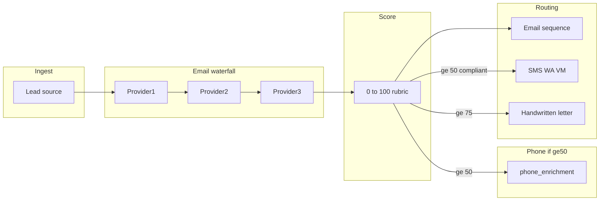
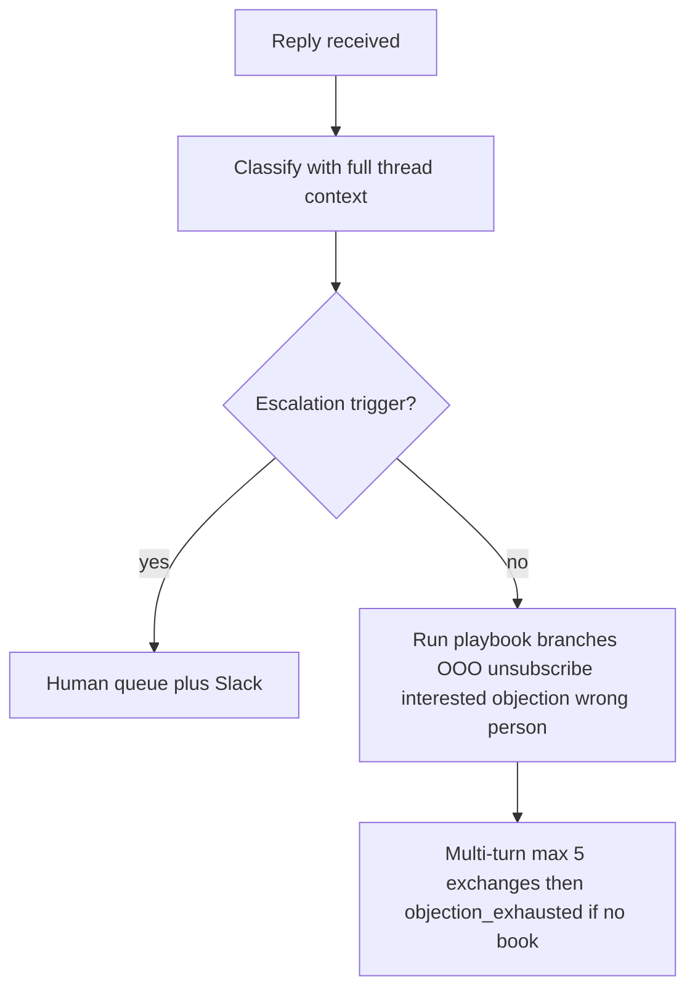

# JMCG AI Outreach — Implementation Blueprint (v2.1)

**Assumptions (v2.1):** Enriched **SAM = 16,000** verified contacts. Architecture aligned with **Jordan Platten / Affluent.co**–style automation. Niche/offer/ICP: **Johnson Marketing & Consulting (JMCG)** service verticals—populate case studies before launch. **Runtime:** **Supabase** = database + lightweight scheduling (**pg_cron** HTTP triggers, DB webhooks); **Vercel Pro** = serverless workers (heavy AI + batch jobs); **Smartlead** = sending + webhooks; **Claude API** = model layer. **Cursor** = IDE; **Claude** = coding agent for implementation.

---

## 1. The Math & Infrastructure

### Core formulas (keep in a config table or env)

| Metric | Formula | JMCG value (SAM = 16,000) |
|--------|---------|---------------------------|
| **Daily send rate** | `SAM / 90` | **178 sends/day** |
| **Email accounts required** | `ceil(daily_sends / 10)` | **18 accounts** |
| **Backup accounts (10% reserve)** | `ceil(accounts * 0.10)` | **2 accounts** |
| **Total accounts to warm** | primary + backups | **20 accounts** |
| **Secondary domains required** | `ceil(total_accounts / 15)` | **2 domains** (**15** on domain A, **5** on domain B) |
| **Warmup window** | 2–4 weeks staggered | Same |

**Key metrics summary**

- **Daily sends (planned):** **178**
- **Primary sending mailboxes:** **18**; **backup (warmed):** **2**; **total to warm:** **20**
- **Secondary domains:** **2** (plus primary brand domain for site, redirects, compliance as needed)

### Operational checklist (infrastructure)

- **Backup pool:** Maintain **10% warmed backup accounts** at all times; **swap in** when a primary mailbox hits spam or complaint thresholds.
- **Capacity pacing:** Store `daily_quota_per_mailbox = floor(daily_sends / active_warmed_accounts)` and **rebalance dynamically** as accounts rotate in/out (including backup activation).
- **Smartlead:** Campaign or partition per mailbox/domain group; align **sending windows** and **daily limits** with provider and Smartlead caps. **Daily caps:** `floor(178 / 18) = 9` sends per primary mailbox (rebalance when backups replace primaries).
- **Supabase:** See **Section 3** (schema) and **Section 8** (tech stack) for tables and integrations.

### Projected conversion metrics (conservative)

| Metric | Conservative (0.5% book rate) | Optimistic (1% book rate) |
|--------|-------------------------------|---------------------------|
| Meetings/day | ~0.9 | ~1.8 |
| Meetings/month | ~27 | ~53 |
| Show rate (60%) | ~16 | ~32 |
| New clients/month (20% close) | ~3 | ~6 |

### DNS / deliverability checklist (per secondary domain)

Apply to **each** secondary domain used for outbound:

- **SPF:** Single SPF authorizing Smartlead (and overlapping ESP if any); avoid >10 DNS lookups; no conflicting SPFs.
- **DKIM:** Enable in Smartlead; publish **CNAME/TXT**; verify pass in tests.
- **DMARC:** Start `p=none` (or `quarantine` if mature), `rua` to monitoring inbox; tighten after stable alignment.
- **MX:** Correct MX for the domain.
- **BIMI (optional):** After DMARC maturity.
- **PTR / rDNS:** If dedicated IPs, align forward/reverse DNS.
- **From-name / From-domain:** Align with DKIM signing domain.
- **Unsubscribe / physical address:** CAN-SPAM/GDPR-aligned footer and list-unsubscribe where applicable.
- **Warmup:** 2–4 weeks progressive volume; stagger the **20** mailboxes; monitor bounce/complaint per mailbox.

---

## 2. Runtime Architecture — Supabase + Vercel

**Principle:** **Supabase** owns **data** and **scheduling**. **Vercel** owns **compute**. **Smartlead** owns **sending**. **Claude API** owns **intelligence**.

```
┌─────────────────────────────────────────────────────────┐
│                     SUPABASE                            │
│                                                         │
│  PostgreSQL ─── All tables (leads, scores, sequences,   │
│  │               messages, qa_results, experiments,     │
│  │               replies, optimization_log,             │
│  │               mailbox_health, cooldown_queue,          │
│  │               channel_dispatch, enrichment_runs)      │
│  │                                                      │
│  pg_cron ───── Scheduled triggers:                      │
│  │             • Every 10 min: enrichment batch          │
│  │             • Every 10 min: scoring batch             │
│  │             • Every 15 min: copy generation batch     │
│  │             • Every 2 min: send queue flush           │
│  │             • 1st of month: optimization trigger      │
│  │             • Daily: cooldown re-entry check          │
│  │                                                      │
│  │  (pg_cron calls fire HTTP POST to Vercel endpoints)  │
│  │                                                      │
│  DB Webhooks ── On insert to replies table →            │
│                 fire to Vercel reply-agent endpoint      │
└──────────────────────┬──────────────────────────────────┘
                       │ HTTP
┌──────────────────────▼──────────────────────────────────┐
│                     VERCEL                              │
│              (Serverless Functions — Pro plan)            │
│              Max 300s execution per invocation            │
│                                                         │
│  /api/workers/waterfall-enrich                          │
│    Pull next batch of unenriched leads from Supabase    │
│    Run provider chain (Clay → Lead Magic → Hunter)      │
│    Respect per-lead cost cap                            │
│    Write results back to enrichment_runs + leads        │
│                                                         │
│  /api/workers/score                                     │
│    Pull enriched-but-unscored leads                     │
│    Apply 0-100 rubric                                   │
│    Write scores, set channel_flags                      │
│    Trigger phone enrichment for score >= 50             │
│                                                         │
│  /api/workers/phone-enrich                              │
│    Pull leads with score >= 50 and phone_enriched=false │
│    Run phone provider(s)                                │
│    Write back to enrichment_runs + leads                │
│                                                         │
│  /api/workers/copy-generate                             │
│    Pull leads ready for next touch                      │
│    Match leverage library entry (tag-based)             │
│    Call Claude API — generate email (AIDA prompt)       │
│    Call Claude API — QA gate                            │
│    Pass → write to messages (queued for send)           │
│    Regenerate → retry up to 3x, then failed_qa          │
│                                                         │
│  /api/workers/send-queue                                │
│    Pull approved messages from Supabase                 │
│    Push to Smartlead API                                │
│    Update message status                                │
│                                                         │
│  /api/workers/reply-agent                               │
│    Triggered by Smartlead reply webhook                 │
│    Load full thread context from Supabase               │
│    Classify intent via Claude API                       │
│    Check escalation triggers → Slack if hit             │
│    Otherwise run objection playbook (multi-turn)        │
│    Write reply via Smartlead API                        │
│    Update replies table                                 │
│                                                         │
│  /api/workers/monthly-optimize                          │
│    Aggregate 30-day metrics from experiments            │
│    Run Phase 2 analysis (variant compare, mailbox       │
│      health, channel ROI, sequence touch lift)          │
│    Auto-apply Phase 3 changes                           │
│    Write to optimization_log                            │
│    Send Slack/email summary to Cody                     │
│                                                         │
│  /api/workers/cooldown-reentry                          │
│    Pull leads where cooldown_until <= now               │
│    Increment cycle_number                               │
│    Trigger re-enrichment + re-score                     │
│    Queue for copy generation with new angle             │
│                                                         │
│  /api/cron-receiver                                     │
│    Auth middleware (shared secret between pg_cron       │
│    HTTP calls and Vercel) — reject unauthorized calls   │
│                                                         │
└──────────────────────┬──────────────────────────────────┘
                       │ API calls
┌──────────────────────▼──────────────────────────────────┐
│                   SMARTLEAD                             │
│                                                         │
│  Receives send requests via API                         │
│  Fires reply/open webhooks → Vercel /api/workers/       │
│  Manages mailbox rotation, warmup, daily caps           │
└─────────────────────────────────────────────────────────┘
```

### Worker design rules

- **Batch size:** Each invocation processes a configurable batch (e.g. **10–25** leads). Stays under Vercel’s **300s** limit with multiple Claude round-trips. If the queue exceeds one batch, process a batch and return; **pg_cron** fires again on the next interval for the remainder.
- **Idempotency:** Workers must be **idempotent**. On timeout/failure mid-batch, the next run continues safely. Use row **status** fields (e.g. `enrichment_status = 'pending' | 'in_progress' | 'complete' | 'failed'`) and **atomic** `UPDATE … RETURNING` to claim work and avoid duplicate processing.
- **Auth:** All Vercel endpoints require a **shared secret** (env on Supabase + Vercel). **pg_cron** HTTP calls and **Smartlead** webhooks send the secret in a header; **middleware** rejects unauthorized requests.
- **Error handling:** On transient failure (Claude timeout, provider **500**), retry the **individual lead** up to **2×** in the same invocation. On persistent failure, mark **`failed`** with an error message and continue — do not block the batch.
- **Logging:** Log each invocation to **`worker_runs`** in Supabase: `worker_name`, `started_at`, `completed_at`, `batch_size`, `success_count`, `error_count`, `error_details` (jsonb).

### pg_cron schedule (defaults — configurable)

| Job | Interval | Vercel endpoint | Notes |
|-----|----------|-----------------|-------|
| Enrichment batch | Every **10** min | `/api/workers/waterfall-enrich` | e.g. **20** leads per batch |
| Scoring batch | Every **10** min | `/api/workers/score` | e.g. **50** leads per batch |
| Phone enrichment | Every **15** min | `/api/workers/phone-enrich` | score ≥ 50, `phone_enriched=false` |
| Copy generation | Every **15** min | `/api/workers/copy-generate` | e.g. **10** leads per batch (heaviest) |
| Send queue flush | Every **2** min | `/api/workers/send-queue` | approved → Smartlead |
| Reply agent | **Webhook** (real-time) | `/api/workers/reply-agent` | Smartlead → Vercel |
| Cooldown re-entry | **Daily 6am ET** | `/api/workers/cooldown-reentry` | `cooldown_until <= now` |
| Monthly optimization | **1st of month 8am ET** | `/api/workers/monthly-optimize` | analysis + auto-apply |

### Environment variables (Vercel)

| Variable | Purpose |
|----------|---------|
| `SUPABASE_URL` | Supabase project URL |
| `SUPABASE_SERVICE_ROLE_KEY` | Server-side access (not anon key) |
| `CLAUDE_API_KEY` | Anthropic — copy, QA, reply agent, optimization |
| `SMARTLEAD_API_KEY` | Send + campaign APIs |
| `CRON_SECRET` | Shared secret for pg_cron → Vercel |
| `SMARTLEAD_WEBHOOK_SECRET` | Validate Smartlead webhooks |
| `SLACK_WEBHOOK_URL` | Escalations + monthly reports |
| `ENRICHMENT_CLAY_API_KEY` | Clay (or primary provider) |
| `ENRICHMENT_LEADMAGIC_API_KEY` | Lead Magic |
| `ENRICHMENT_HUNTER_API_KEY` | Hunter |
| `MAX_ENRICHMENT_COST_PER_LEAD` | Default: **0.15** |

### Vercel Pro requirement

**Vercel Pro (~$20/mo)** is required for: **300s** function timeout (Hobby **60s** is insufficient), higher invocation limits for cron-driven batches, and concurrency for webhook-driven **reply-agent** traffic.

---

## 3. Data & Scoring Blueprint (0–100)

### Purpose — Surround Sound (with compliance prerequisites)

- **All leads (any score):** Full **email** sequence (see **Section 4** for configurable 4–5 touches).
- **Score ≥ 50:** Email + **WhatsApp/SMS** (region-dependent) + **voicemail drop** — **only after compliance is cleared** (see below).
- **Score ≥ 75:** All of the above + **handwritten letter** via `channel_dispatch`.

**BLOCKING prerequisite for SMS/voicemail**

- Complete **TCPA/GDPR** (and applicable regional) review **before** activating SMS/voicemail.
- **Enrichment-sourced phone numbers are not consent.** Define lawful basis (e.g., legitimate interest under GDPR, or an **explicit consent** collection path for TCPA).
- On `leads`: store `sms_consent`, `voice_consent`, `consent_source`, `consent_date`.
- **Do not** activate SMS/voicemail until the **compliance-review** TODO is resolved.

### Recommended score model (total 100) — unchanged structure

**A. Fit to ICP (0–40)** — Title/seniority (0–12), company size/revenue (0–10), industry/geo (0–10), tech/trigger signals (0–8).

**B. Contact quality (0–25)** — Verified email (0–10), phone/mobile quality (0–8), LinkedIn/social (0–4), toxicity penalty (up to −10, floor 0).

**C. Intent / timing (0–20)** — Intent keywords (0–10), engagement proxy (0–10).

**D. Leverage alignment (0–15)** — Match strength vs. **Leverage Library** (see **tag-based matching** below).

**Trigger mapping (`lead_score` + `channel_flags`)**

- Email always (full sequence).
- Surround-sound channels (SMS/WhatsApp/voicemail) only if score ≥ 50 **and** compliance + consent rules satisfied.
- Direct mail if score ≥ 75 (plus vendor integration).

### Leverage Library matching (tag-based — no embeddings at JMCG scale)

At **5–15 case studies**, use **tag-based** matching only (revisit embeddings if library **exceeds ~50** entries).

- Each entry: `industry_tags[]`, `persona_tags[]`, `geo`, `company_archetype`.
- Match against `lead.industry`, `lead.title`, `lead.geo`, `lead.company_size_band`.
- **Scoring:** exact industry + exact persona → **15**; partial match → **8**; weak → **3**; no match → **0**.
- **Tie-break:** prefer the entry with the **strongest quantified metric**.

### Cost-gated waterfall (apply before provider chain)

- Config: **`max_enrichment_cost_per_lead`** (e.g. **$0.15**).
- Track **cumulative** cost per lead in `enrichment_runs` (see **`cumulative_cost`** below).
- **Halt** waterfall when the cap is reached, even if email/phone is still missing.

### Phone enrichment gating (~5× email cost)

1. Run the **full email waterfall** first.
2. **Score** all leads on **email-only** data.
3. Run **phone enrichment only** for leads scoring **≥ 50**.
4. Log phone enrichment as its own `enrichment_runs` row with `provider_order = 'phone_enrichment'`.

### Waterfall enrichment (Supabase pattern)

- `enrichment_runs`: `lead_id`, `provider_order` (e.g. Clay → Lead Magic → Hunter, then optional `phone_enrichment`), `status`, `payload`, `cost`, **`cumulative_cost`**, `timestamp`.
- Advance to the next provider when data is missing or low confidence — **unless** cost cap is hit.



### Supabase schema additions (v2 / v2.1)

**`leads` — add**

- `cycle_number` (integer, default **1**)
- `previous_library_entry_ids` (jsonb array)
- `sms_consent`, `voice_consent` (boolean, default false)
- `consent_source` (text, nullable), `consent_date` (timestamptz, nullable)
- `phone_enriched` (boolean, default false)

**`enrichment_runs` — add**

- `cumulative_cost` (numeric) — running total per lead across providers

**`qa_results` — status enum**

- Valid: **`pass`**, **`regenerate`**, **`failed_qa`** (remove `revise`).
- Add **`regeneration_attempt`** (integer, 1–3).

**`replies` — add**

- `escalation_reason` (text, nullable) when routing to human

**New: `optimization_log`**

- `id` (uuid), `cycle_date` (date), `change_type` (text), `old_value` (jsonb), `new_value` (jsonb), `data_basis` (jsonb), `human_override` (boolean, default false), `override_reason` (text, nullable)

**New: `mailbox_health`**

- `mailbox_id`, `domain`, `status` (`active` | `warmup` | `paused` | `backup`), `bounce_rate_30d`, `complaint_rate_30d`, `last_health_check`, `pause_reason` (nullable)

**New: `worker_runs` (v2.1)**

- `id` (uuid)
- `worker_name` (text) — e.g. `waterfall-enrich`, `copy-generate`, `reply-agent`
- `started_at`, `completed_at` (timestamptz, nullable)
- `batch_size`, `success_count`, `error_count` (integer)
- `error_details` (jsonb, nullable)

---

## 4. Copywriting Logic & Prompt Engineering

### Leverage Library (data shape in Supabase)

Each asset: `id`, `title`, `industry_tags[]`, `persona_tags[]`, `problem`, `approach`, `metrics`, `quote_snippet`, `constraints`, `geo`, `company_archetype`.

### Sequence structure (configurable — not fixed 4 touches)

- **Default:** Cold open → Bump 1 → Bump 2 → Breakup (**4** touches).
- **Extended test:** Cold open → Bump 1 → Bump 2 → **Bump 3** → Breakup (**5** touches).
- Store **`max_touches`** in config; add/remove bumps **without code changes**.
- **Monthly optimization** (Section 5) decides 4 vs 5: if Bump 3 adds meaningful incremental replies, keep 5; if negligible, revert to 4.

**Default touch timing (configurable)**

| Touch | Delay from previous |
|-------|---------------------|
| Cold open | Day 0 |
| Bump 1 | Day 3 |
| Bump 2 | Day 7 |
| Bump 3 (if enabled) | Day 12 |
| Breakup | Day **18** (5-touch) or Day **14** (4-touch) |

### Master prompt — AI copywriter (AIDA + QA inputs)

Use as **system + user** template with merged variables:

```text
You are an expert B2B cold email copywriter. Write ONE outbound email for a single human recipient.

GOALS
- Maximize reply rate and meeting interest without deception.
- Use AIDA: Attention, Interest, Desire, Action.
- Tie the message to exactly ONE case study from the LEVERAGE_LIBRARY entry provided (do not blend multiple stories).
- Sound like a thoughtful peer, not marketing blast copy.

HARD RULES
- Length: 75–120 words (strict). If over, rewrite shorter.
- No spam triggers: avoid excessive exclamation points, ALL CAPS, “guaranteed”, “100%”, “free money”, crypto/medical claims, or misleading subject lines.
- No fabricated metrics; only use numbers present in LEVERAGE_LIBRARY or LEAD_VERIFIED_FACTS.
- If a fact is missing, omit it—do not guess.
- Include a single clear CTA: a question that invites a reply OR a single scheduling link (use whichever is provided in INPUT).
- No more than ONE question in the email body (see QA gate).

INPUT
LEAD:
- Name: {{lead.first_name}} {{lead.last_name}}
- Title: {{lead.title}}
- Company: {{lead.company}}
- Industry: {{lead.industry}}
- Location: {{lead.location}}
- Signals: {{lead.signals_json}}
- Verified facts (from enrichment only): {{lead.verified_facts_json}}
- Cycle: {{cycle_number}} (re-entry uses a fresh angle vs prior cycles)

LEVERAGE_LIBRARY_ENTRY (use only this; must not repeat IDs in {{previous_library_entry_ids}}):
{{library_entry_json}}

SEQUENCE_CONTEXT
- Touch: {{touch_index}} of {{max_touches}} (1=cold open, then bumps, last=breakup)
- Prior subject line (if any): {{prior_subject}}

OUTPUT FORMAT (JSON only)
{
  "subject": "...",
  "body": "...",
  "aida_trace": {
    "attention": "one sentence explaining hook",
    "interest": "one sentence explaining relevance",
    "desire": "one sentence explaining outcome",
    "action": "one sentence explaining CTA"
  },
  "library_entry_id": "{{library_entry_id}}",
  "personalization_tokens_used": ["..."]
}
```

**Touch logic:** Bumps/breakup — shorter; reference the thread conceptually without duplicating the full prior body.

---

## 5. Quality Assurance & Monthly Self-Healing Optimization

### Pre-send QA agent (two-tier gate)

- **`pass`:** Queue for send.
- **`regenerate`:** Discard draft; **new** generation for the same lead/touch. **Max 3** regeneration attempts per lead per touch. Record **`regeneration_attempt`** in `qa_results`.
- **`failed_qa`:** If all 3 regenerations fail, log and **skip that touch** for the lead.

**QA checks**

- Word count in configured band (default **75–120**).
- Configurable **blocklist** (spam-trigger phrases).
- **No more than 1 question** in the email body.
- **Fact check:** every number must exist in `LEAD_VERIFIED_FACTS` or `LEVERAGE_LIBRARY_ENTRY`; if hallucinated, **regenerate**.
- Subject line must not be **misleading** vs body (AI semantic check).

### Monthly self-optimization cycle (replaces biweekly split tests)

**Trigger:** **1st of each month**, or **30 days** from launch, then every **30 days**.

**Phase 1 — Data collection (continuous)**

Log to **`experiments`** and **`qa_results`** (and related metrics):

- Per **variant:** sends, opens, replies, positive replies, meetings booked, unsubscribes, spam complaints.
- Per **mailbox:** bounces, spam placement, complaints.
- Per **channel:** email vs SMS vs voicemail vs direct mail.
- Per **Leverage Library entry:** reply and booking lift by segment.

**Phase 2 — Monthly analysis (automated agent)**

1. **Copy:** Compare subject, first-line hook, CTA (question vs calendar), and case-study assignment by segment. **Retire** any variant underperforming the leader by **>25% relative** on **reply rate** with **≥ 150 sends**. **Minimum sample 150** — otherwise carry forward.
2. **Sequence:** Measure **incremental reply rate per touch**. If a touch adds **&lt;0.1%** incremental reply with **≥ 500** sends through that touch, recommend disabling it.
3. **Mailbox health:** Flag bounce **>5%** or complaint **>0.1%**; **auto-pause**, **activate backup**, log swap (see **`optimization_log`** + **`mailbox_health`**).
4. **Channel ROI:** Cost-per-meeting by channel; flag if **&gt;3×** email-only cost-per-meeting.

**Phase 3 — Auto-apply**

- Promote winners; retire losers.
- Spawn **2 new test variants** next cycle from the winner (**one variable at a time**: subject **or** hook **or** CTA).
- Adjust **touch count** when data supports it.
- Swap mailboxes on health breaches.
- Write all changes to **`optimization_log`** (`cycle_date`, `change_type`, `old_value`, `new_value`, `data_basis`).

**Phase 4 — Human review**

- Post–auto-apply: summary to **Slack** or email **cody@johnsonmarketingandconsulting.com** — what changed, why, before/after metrics, manual flags (compliance, channel cost).
- **Cody** may **override** within **48 hours**; after that, changes are treated as accepted.

---

## 6. Agent Workflows — AI Appointment Setter (multi-turn)

### Core behaviors

- **SLA:** **&lt; 2 minutes** from Smartlead reply **webhook** to **sent** reply.
- **Context:** Full thread — all prior outbound and inbound messages for the lead.
- **Multi-turn:** Not single-shot; maintain state across exchanges.
- **Objection persistence:** Up to **5** back-and-forth exchanges on an objection; if no booking, mark **`objection_exhausted`** and enter **cooldown** (Section 7).
- **Booking:** One primary calendar link; optional two concrete time windows.

### Human escalation (Slack notify Cody/Caleb)

Route to human queue when:

- Lead asks for a **human/manager**.
- **Legal / lawsuit / threats** language.
- Company **&gt;$10M revenue** (high value — avoid AI-only handling).
- Agent **classification confidence** below configurable threshold.
- **Technical** question outside agent context.

Store **`escalation_reason`** on `replies`.

### Logic tree (high level)



### JMCG objection playbook (structural templates)

Populate with **real JMCG case studies and outcomes** before launch.

1. **“We already have a marketing agency.”** — Acknowledge → pivot to **specific signal/gap** → offer **time-boxed** comparison call.
2. **“Not interested.”** — Acknowledge → **timing vs permanent no** → if timing, schedule follow-up month; if permanent, **suppress**.
3. **“Send me info.”** — Acknowledge → **one qualifying question** → send matching **1-pager** → micro-CTA to book **15 minutes**.
4. **“How much does this cost?”** — Acknowledge → **value before price** → offer ROI walkthrough on a **short call**.
5. **“We handle marketing in-house.”** — Acknowledge → **augmentation** (not replacement) → cite **hybrid** client case study.

---

## 7. The 90-Day Cycle & Cooldown

- If **no meeting booked** and the sequence is exhausted, move the lead to **`cooldown_queue`** with **`cooldown_until = now + 90 days`**.
- On **re-entry:**
  - **`cycle_number++`** (default **1** on first pass).
  - **Re-run enrichment** (signals, intent, title changes) and **re-score** before any sequence.
  - Pass **`cycle_number`** and **`previous_library_entry_ids`** to copy generation; pick a **new** Leverage Library angle **not** in `previous_library_entry_ids`.
  - Append chosen `library_entry_id` to **`previous_library_entry_ids`**.
  - Reset **experiment bucket** as appropriate so the lead is not stuck on a losing variant.

---

## 8. Tech Stack Wiring

- **Supabase:** Source of truth for **all data**. **pg_cron** schedules worker triggers via **HTTP** to Vercel. **Database webhooks** (e.g. on `replies` insert) for real-time routing where useful. **No** heavy AI compute inside Supabase.
- **Vercel (Pro — serverless functions):** All **AI-heavy** and batch workers: enrichment, scoring, copy + QA, send queue, **reply-agent** webhook (**&lt;2 min** SLA), **monthly-optimize**, **cooldown-reentry**. Authenticate with **shared secrets** (`CRON_SECRET`, `SMARTLEAD_WEBHOOK_SECRET`). See **Section 2**.
- **Smartlead:** Sending, mailbox management, warmup, **reply/open webhooks** → Vercel worker endpoints.
- **Claude API (Anthropic):** Copy generation (AIDA), QA gate, reply-agent classification + objections, monthly optimization analysis.
- **Slack:** Human-queue escalations and monthly optimization summaries.
- **Enrichment providers:** Invoked from Vercel waterfall workers; configurable chain + **cost cap**.
- **SMS/WhatsApp/voicemail/direct mail:** Behind **`channel_dispatch`**; **BLOCKING** on compliance before activation.
- **Cursor + Claude (development):** **Cursor** = IDE; **Claude** = coding agent to build/maintain workers, prompts, and infra-as-code.
- **Internal command center (dashboard):** **Phase 2** — see **Section 11**. Not a substitute for building the pipeline first.

---

## 9. v1 → v2 Summary

| Area | v1 | v2 |
|------|----|----|
| SAM | 20,000 | **16,000** |
| Daily sends | ~222 | **178** |
| Mailboxes | 23 | **18 + 2 backup = 20** |
| Domains | 2 | **2** (15 + 5) |
| Phone enrichment | All leads | **Score ≥ 50 only** |
| Enrichment cost | No cap | **Per-lead budget cap** |
| QA | approved / revise / block | **pass / regenerate / failed_qa** |
| Optimization | Biweekly | **Monthly self-healing** |
| Min sample | Undefined | **150 sends per variant** |
| Sequence | Fixed 4 | **Configurable 4–5** |
| Reply agent | Single-shot | **Multi-turn, 5-exchange cap** |
| Human escalation | — | **Triggers + Slack** |
| Response SLA | “Immediate” | **&lt; 2 minutes** |
| Cooldown re-entry | New angle | **Re-enrich, re-score, cycle_number, no repeat library IDs** |
| Compliance | TODO | **BLOCKING for SMS/voice** |

### v2.1 — Runtime split (addendum)

| Area | v2 (prior) | v2.1 |
|------|------------|------|
| Compute location | Implied generic “workers” | **Vercel Pro** serverless (`/api/workers/*`) |
| Scheduling | Unclear | **Supabase pg_cron** → HTTP to Vercel |
| Supabase role | Database | Database + **scheduling triggers** + **`worker_runs` logs** |
| Auth for jobs | — | **Shared secrets** on cron + webhooks |
| Reply path | Smartlead webhook → worker | Explicit **Vercel** `/api/workers/reply-agent` |

---

## 10. Git & Collaboration Workflow

**Context:** Two developers; **GitHub** is the source of truth. Any AI agent (or automation) touching this repo should follow this workflow.

### Rules for the agent

- **Never skip pulling before starting work.** Always assume the remote may have changes.
- **Commit frequently** — after every meaningful change or feature addition, not in one giant batch at the end.
- **Write descriptive commit messages** that explain what changed and why (e.g. `feat: add user auth with JWT`, not `update`).
- **Do not commit** `node_modules/`, `.env`, or other local-only config. Ensure **`.gitignore`** covers them.

### Standard commit flow (`main`)

```bash
git pull origin main        # Always first
git add .
git commit -m "your message here"
git push origin main
```

### Branch flow (larger features)

```bash
git checkout -b feature/your-feature-name
# make changes, commit often
git push origin feature/your-feature-name
# open Pull Request on GitHub to merge into main
```

### Conflict resolution

If a **pull** produces a **merge conflict**, **stop** and surface it to the developer. **Do not** auto-resolve conflicts — list the affected files and let a developer choose which version to keep.

---

## 11. Internal Command Center (Dashboard) — Phase 2

**Role:** A **logged-in internal hub** that ties the stack together — enrichment → scoring → send → reply → booking — without replacing provider-native UIs (e.g. Smartlead’s own reports stay the deep-dive; this is the **operator’s command center**).

### Sequencing (critical)

**Do not** invest in dashboard UI polish until the **software structure is built and stable**:

1. **Supabase schema** + **Vercel workers** (enrich, score, copy+QA, send-queue, reply-agent) running reliably.
2. **Idempotent batches**, **`worker_runs`** logging, and **truthful** row states in Postgres (pipeline stages, message status).
3. **Smartlead** send + webhook path proven end-to-end.

Only then start the dashboard — first as **functional** pages (correct numbers, fast loads), then refine layout/visuals.

**Gates before dashboard MVP:** `orchestration-workers` + `send-queue` path validated; `replies` / thread data usable; basic aggregates testable in SQL or a script.

### What to show (prioritized)

**MVP (dashboard v0 — Supabase-only reads)**  
- **Pipeline snapshot:** counts by stage (e.g. pending enrich → scored → queued → sent → cooldown/failed).  
- **Worker health:** recent **`worker_runs`** (success/error, batch sizes) — surface failures immediately.  
- **QA / enrichment alerts:** spikes in `regenerate` / `failed_qa`; enrichment **cost vs cap** rollups.  
- **Mailbox strip:** link **`mailbox_health`** (active / paused / backup) to “why sends dropped.”

**Next (dashboard v1 — add provider + outcomes)**  
- **Email performance:** sends and, where available, **open rate** and **reply rate** by **day / week / month** — via **scheduled sync** from Smartlead API into Supabase (e.g. `provider_metrics_daily`); **never** call Smartlead from the browser with secrets.  
- **Bookings:** webhook from scheduling tool (Cal.com, Calendly, CRM) into **`appointments`** (or equivalent), joined to **lead_id**.

**Later (dashboard v2)**  
- **Experiments** + **`optimization_log`** timeline (monthly self-healing visibility).  
- **Surround-sound** panels (SMS / voicemail / direct mail cost-per-meeting) once channels are **compliance-cleared**.

### UX / IA sketch (keep utilitarian)

- **Overview:** KPI strip + **alerts** (paused mailboxes, worker errors, QA/enrichment anomalies).  
- **Outreach:** time-series sends; breakdown by mailbox/domain when data exists.  
- **Enrichment:** waterfall + spend.  
- **Replies:** SLA buckets, escalation counts.  
- **Optimization:** variants + last cycle summary (when monthly job exists).

Avoid custom charting extravagance until **definitions are trusted** (single source of truth per metric).

### Security

- **Supabase Auth** (or equivalent) + **RLS** for multi-user internal access.  
- Dashboard uses **server-side** or **anon+RLS** patterns only — **no `SUPABASE_SERVICE_ROLE_KEY` in the client.**

### Build placement

- Likely **same Vercel project** as workers (e.g. Next.js app routes) or a **dedicated** internal app deployed to a **private** URL — team decision when Phase 2 starts.

---

## What you should customize next

Lock **JMCG** case studies into the Leverage Library, finalize **ICP weights** within the 0–100 rubric, complete **legal/compliance** and consent capture, wire **Slack** + override workflow for monthly optimization reports, and treat the **command center** as **Phase 2** after the pipeline is proven.
