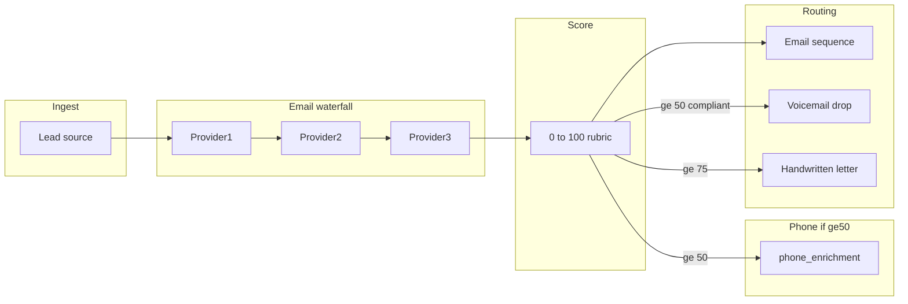
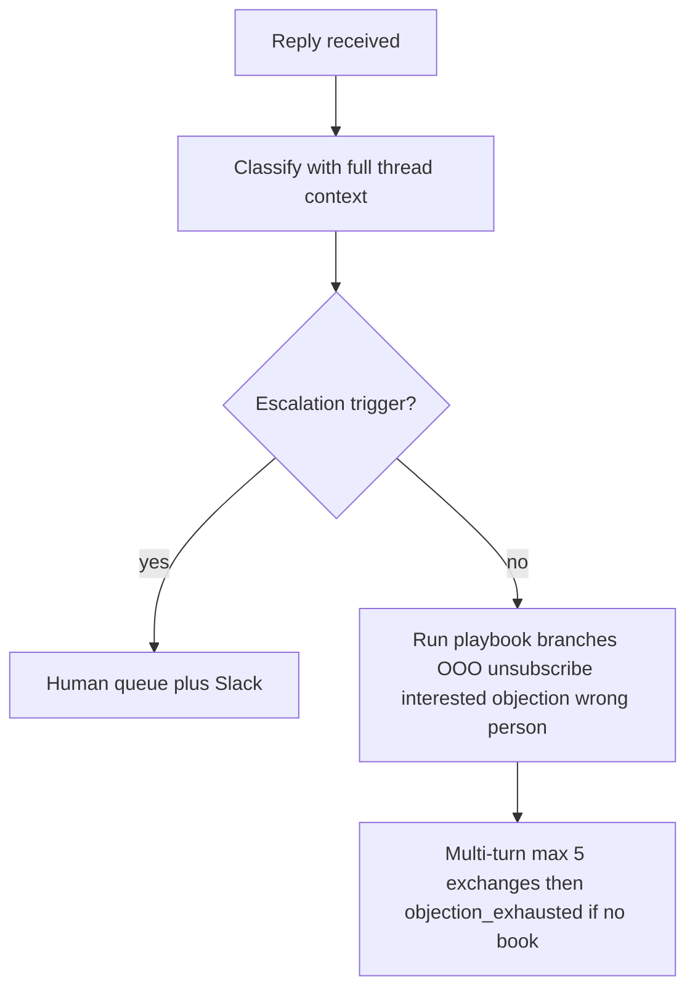

# JMCG AI Outreach — Implementation Blueprint (v2.1)

**Assumptions (v2.1):** Enriched **SAM = 16,000** verified contacts. **Offer:** **Johnson Marketing & Consulting (JMCG)** marketing services. **Launch ICP:** **US residential HVAC** companies in the **$3M–$7M revenue** band (see **Section 3 — Ideal Customer Profile**); qualification uses **proxy signals** (not raw revenue from vendors — often unreliable for private local shops). Architecture aligned with **Jordan Platten / Affluent.co**–style automation. **Runtime:** **Supabase** + **pg_cron** + DB webhooks; **Vercel Pro** workers; **Smartlead**; **Claude API**. **Cursor** = IDE; **Claude** = coding agent. **US outbound channels:** **email**, **voicemail drop** (score ≥ 50), **handwritten letter** (score ≥ 75). **SMS and WhatsApp are not used.**

---

## 1. The Math & Infrastructure

### Core formulas (keep in a config table or env)

| Metric | Formula | JMCG value (SAM = 16,000) |
|--------|---------|---------------------------|
| **Daily send rate** | `SAM / 90` | **178 sends/day** |
| **Email accounts required** | `ceil(daily_sends / 10)` | **18 accounts** |
| **Backup accounts (10% reserve)** | `ceil(accounts * 0.10)` | **2 accounts** |
| **Total accounts to warm** | primary + backups | **20 accounts** |
| **Secondary domains required** | `ceil(total_accounts / 15)` | **2 domains** (**15** on domain A, **5** on domain B) |
| **Warmup window** | 2–4 weeks staggered | Same |

**Key metrics summary**

- **Daily sends (planned):** **178**
- **Primary sending mailboxes:** **18**; **backup (warmed):** **2**; **total to warm:** **20**
- **Secondary domains:** **2** (plus primary brand domain for site, redirects, compliance as needed)

### Operational checklist (infrastructure)

- **Backup pool:** Maintain **10% warmed backup accounts** at all times; **swap in** when a primary mailbox hits spam or complaint thresholds.
- **Capacity pacing:** Store `daily_quota_per_mailbox = floor(daily_sends / active_warmed_accounts)` and **rebalance dynamically** as accounts rotate in/out (including backup activation).
- **Smartlead:** Campaign or partition per mailbox/domain group; align **sending windows** and **daily limits** with provider and Smartlead caps. **Daily caps:** `floor(178 / 18) = 9` sends per primary mailbox (rebalance when backups replace primaries).
- **Supabase:** See **Section 3** (schema) and **Section 9** (tech stack) for tables and integrations.

### Projected conversion metrics (conservative)

| Metric | Conservative (0.5% book rate) | Optimistic (1% book rate) |
|--------|-------------------------------|---------------------------|
| Meetings/day | ~0.9 | ~1.8 |
| Meetings/month | ~27 | ~53 |
| Show rate (60%) | ~16 | ~32 |
| New clients/month (20% close) | ~3 | ~6 |

### DNS / deliverability checklist (per secondary domain)

Apply to **each** secondary domain used for outbound:

- **SPF:** Single SPF authorizing Smartlead (and overlapping ESP if any); avoid >10 DNS lookups; no conflicting SPFs.
- **DKIM:** Enable in Smartlead; publish **CNAME/TXT**; verify pass in tests.
- **DMARC:** Start `p=none` (or `quarantine` if mature), `rua` to monitoring inbox; tighten after stable alignment.
- **MX:** Correct MX for the domain.
- **BIMI (optional):** After DMARC maturity.
- **PTR / rDNS:** If dedicated IPs, align forward/reverse DNS.
- **From-name / From-domain:** Align with DKIM signing domain.
- **Unsubscribe / physical address:** CAN-SPAM/GDPR-aligned footer and list-unsubscribe where applicable.
- **Warmup:** 2–4 weeks progressive volume; stagger the **20** mailboxes; monitor bounce/complaint per mailbox.

---

## 2. Runtime Architecture — Supabase + Vercel

**Principle:** **Supabase** owns **data** and **scheduling**. **Vercel** owns **compute**. **Smartlead** owns **sending**. **Claude API** owns **intelligence**.

```
┌─────────────────────────────────────────────────────────┐
│                     SUPABASE                            │
│                                                         │
│  PostgreSQL ─── All tables (leads, scores, sequences,   │
│  │               messages, qa_results, experiments,     │
│  │               replies, optimization_log,             │
│  │               mailbox_health, cooldown_queue,          │
│  │               channel_dispatch, enrichment_runs)      │
│  │                                                      │
│  pg_cron ───── Scheduled triggers:                      │
│  │             • Every 10 min: enrichment batch          │
│  │             • Every 10 min: scoring batch             │
│  │             • Every 15 min: copy generation batch     │
│  │             • Every 2 min: send queue flush           │
│  │             • 1st of month: optimization trigger      │
│  │             • Daily: cooldown re-entry check          │
│  │                                                      │
│  │  (pg_cron calls fire HTTP POST to Vercel endpoints)  │
│  │                                                      │
│  DB Webhooks ── On insert to replies table →            │
│                 fire to Vercel reply-agent endpoint      │
└──────────────────────┬──────────────────────────────────┘
                       │ HTTP
┌──────────────────────▼──────────────────────────────────┐
│                     VERCEL                              │
│              (Serverless Functions — Pro plan)            │
│              Max 300s execution per invocation            │
│                                                         │
│  /api/workers/waterfall-enrich                          │
│    Pull next batch of unenriched leads from Supabase    │
│    Run provider chain (Clay → Lead Magic → Hunter)      │
│    Respect per-lead cost cap                            │
│    Write results back to enrichment_runs + leads        │
│                                                         │
│  /api/workers/score                                     │
│    Pull enriched-but-unscored leads                     │
│    Apply 0-100 rubric                                   │
│    Write scores, set channel_flags                      │
│    Trigger phone enrichment for score >= 50             │
│                                                         │
│  /api/workers/phone-enrich                              │
│    Pull leads with score >= 50 and phone_enriched=false │
│    Run phone provider(s)                                │
│    Write back to enrichment_runs + leads                │
│                                                         │
│  /api/workers/copy-generate                             │
│    Pull leads ready for next touch                      │
│    Match leverage library entry (tag-based)             │
│    Call Claude API — generate email (AIDA prompt)       │
│    Call Claude API — QA gate                            │
│    Pass → write to messages (queued for send)           │
│    Regenerate → retry up to 3x, then failed_qa          │
│                                                         │
│  /api/workers/send-queue                                │
│    Pull approved messages from Supabase                 │
│    Push to Smartlead API                                │
│    Update message status                                │
│                                                         │
│  /api/workers/reply-agent                               │
│    Triggered by Smartlead reply webhook                 │
│    Load full thread context from Supabase               │
│    Classify intent via Claude API                       │
│    Check escalation triggers → Slack if hit             │
│    Otherwise run objection playbook (multi-turn)        │
│    Write reply via Smartlead API                        │
│    Update replies table                                 │
│                                                         │
│  /api/workers/monthly-optimize                          │
│    Aggregate 30-day metrics from experiments            │
│    Run Phase 2 analysis (variant compare, mailbox       │
│      health, channel ROI, sequence touch lift)          │
│    Auto-apply Phase 3 changes                           │
│    Write to optimization_log                            │
│    Send Slack/email summary to Cody                     │
│                                                         │
│  /api/workers/cooldown-reentry                          │
│    Pull leads where cooldown_until <= now               │
│    Increment cycle_number                               │
│    Trigger re-enrichment + re-score                     │
│    Queue for copy generation with new angle             │
│                                                         │
│  /api/cron-receiver                                     │
│    Auth middleware (shared secret between pg_cron       │
│    HTTP calls and Vercel) — reject unauthorized calls   │
│                                                         │
└──────────────────────┬──────────────────────────────────┘
                       │ API calls
┌──────────────────────▼──────────────────────────────────┐
│                   SMARTLEAD                             │
│                                                         │
│  Receives send requests via API                         │
│  Fires reply/open webhooks → Vercel /api/workers/       │
│  Manages mailbox rotation, warmup, daily caps           │
└─────────────────────────────────────────────────────────┘
```

### Worker design rules

- **Batch size:** Each invocation processes a configurable batch (e.g. **10–25** leads). Stays under Vercel’s **300s** limit with multiple Claude round-trips. If the queue exceeds one batch, process a batch and return; **pg_cron** fires again on the next interval for the remainder.
- **Idempotency:** Workers must be **idempotent**. On timeout/failure mid-batch, the next run continues safely. Use row **status** fields (e.g. `enrichment_status = 'pending' | 'in_progress' | 'complete' | 'failed'`) and **atomic** `UPDATE … RETURNING` to claim work and avoid duplicate processing.
- **Auth:** All Vercel endpoints require a **shared secret** (env on Supabase + Vercel). **pg_cron** HTTP calls and **Smartlead** webhooks send the secret in a header; **middleware** rejects unauthorized requests.
- **Error handling:** On transient failure (Claude timeout, provider **500**), retry the **individual lead** up to **2×** in the same invocation. On persistent failure, mark **`failed`** with an error message and continue — do not block the batch.
- **Logging:** Log each invocation to **`worker_runs`** in Supabase: `worker_name`, `started_at`, `completed_at`, `batch_size`, `success_count`, `error_count`, `error_details` (jsonb).

### pg_cron schedule (defaults — configurable)

| Job | Interval | Vercel endpoint | Notes |
|-----|----------|-----------------|-------|
| Enrichment batch | Every **10** min | `/api/workers/waterfall-enrich` | e.g. **20** leads per batch |
| Scoring batch | Every **10** min | `/api/workers/score` | e.g. **50** leads per batch |
| Phone enrichment | Every **15** min | `/api/workers/phone-enrich` | score ≥ 50, `phone_enriched=false` |
| Copy generation | Every **15** min | `/api/workers/copy-generate` | e.g. **10** leads per batch (heaviest) |
| Send queue flush | Every **2** min | `/api/workers/send-queue` | approved → Smartlead |
| Reply agent | **Webhook** (real-time) | `/api/workers/reply-agent` | Smartlead → Vercel |
| Cooldown re-entry | **Daily 6am ET** | `/api/workers/cooldown-reentry` | `cooldown_until <= now` |
| Monthly optimization | **1st of month 8am ET** | `/api/workers/monthly-optimize` | analysis + auto-apply |

### Environment variables (Vercel)

| Variable | Purpose |
|----------|---------|
| `SUPABASE_URL` | Supabase project URL |
| `SUPABASE_SERVICE_ROLE_KEY` | Server-side access (not anon key) |
| `CLAUDE_API_KEY` | Anthropic — copy, QA, reply agent, optimization |
| `SMARTLEAD_API_KEY` | Send + campaign APIs |
| `CRON_SECRET` | Shared secret for pg_cron → Vercel |
| `SMARTLEAD_WEBHOOK_SECRET` | Validate Smartlead webhooks |
| `SLACK_WEBHOOK_URL` | Escalations + monthly reports |
| `ENRICHMENT_CLAY_API_KEY` | Clay (or primary provider) |
| `ENRICHMENT_LEADMAGIC_API_KEY` | Lead Magic |
| `ENRICHMENT_HUNTER_API_KEY` | Hunter |
| `MAX_ENRICHMENT_COST_PER_LEAD` | Default: **0.15** |

### Vercel Pro requirement

**Vercel Pro (~$20/mo)** is required for: **300s** function timeout (Hobby **60s** is insufficient), higher invocation limits for cron-driven batches, and concurrency for webhook-driven **reply-agent** traffic.

---

## 3. Data & Scoring Blueprint (0–100)

### Purpose — Multi-channel tiers (email, voicemail, handwritten) — US scope

- **All leads (any score):** Full **email** sequence (see **Section 4** for configurable 4–5 touches).
- **Score ≥ 50:** Same email sequence **plus** **voicemail drop** (when a direct phone number is available and compliance allows) — **SMS and WhatsApp are not in scope** for US operations.
- **Score ≥ 75:** All of the above **plus** **handwritten letter** (via `channel_dispatch` / fulfillment vendor).

**BLOCKING prerequisite for voicemail + mail**

- **SMS and WhatsApp are excluded** from this system (do not implement or route them in `channel_dispatch`).
- Complete **legal review** (e.g. **TCPA** and state rules for **prerecorded voicemail**, plus direct-mail marketing rules) **before** activating voicemail drops or handwritten mail.
- **Enrichment-sourced phone numbers are not consent** by themselves; follow counsel-approved **consent / suppression / DNC** handling.
- On `leads`: store **`voice_consent`** (and optional `consent_source`, `consent_date`) for voicemail where your counsel requires it; **omit `sms_consent`** (no SMS channel).
- **Do not** activate voicemail or mail channels until the **compliance-review** TODO is resolved.

### Ideal Customer Profile (HVAC — launch vertical)

**Who:** Independent / owner-operated **residential HVAC** (heating & cooling) contractors. **Revenue target:** **$3M–$7M** ideal; **$1M+** acceptable floor when proxies support it. **Not** the primary focus: pure plumbing/mechanical/industrial without residential HVAC positioning, franchise chains at scale, or corporate multi-branch enterprises (see disqualifiers below).

**Why proxies (not vendor “revenue” fields):** For private local-service HVAC, **revenue and headcount from Apollo / ZoomInfo / Clay are often modeled and unreliable.** Scoring and list-building should prioritize **observable, scrapable signals** that correlate with the target band.

#### Primary qualification signals (highest confidence — build filters + scoring around these)

1. **Company name** includes **“Heating & Air,” “Heating & Cooling,”** “Heating and Air Conditioning,” or similar — strong indicator of **residential HVAC** vs generic “mechanical” or plumbing. **Exclude** names dominated by **mechanical / plumbing / industrial** unless HVAC heating/cooling keywords are present.
2. **Google Business Profile review count** in **250–1,500** (sweet spot for target scale). *&lt;250* → likely too small; *&gt;1,500* → often too large / chain-like — down-rank or disqualify per rules below.
3. **Active hiring** (Indeed / ZipRecruiter / LinkedIn) for **HVAC technicians, installers, service managers, dispatchers** — growth / capacity intent.
4. **Paid advertising** — **Google Ads, Local Service Ads (LSAs), and/or Meta** — marketing maturity; mid-tier spenders often map to mid-market HVAC.
5. **FSM / CRM stack** — **ServiceTitan, Housecall Pro, FieldEdge** (or similar) via **BuiltWith**, job posts, or site clues — operational maturity.

#### Secondary signals (use to prioritize within the list)

Owner face/name still prominent in branding; **professional** site (booking, financing, team); **residential + commercial** mix; **multi-county** service area from one location; **BBB** / **ACCA** / trade associations.

#### Disqualification rules (hard or heavy penalty)

- **Wrong type:** Name is mechanical/plumbing/industrial **without** heating & cooling keywords; **no** residential service story.
- **Too small:** **&lt;250** reviews, **no** paid ads, template-only site, **no** hiring in **12** months, residential-only micro-shop (use judgment + review band).
- **Too large:** **&gt;1,500** reviews, many branches / franchise HQ patterns, owner invisible in brand, dominant enterprise ad footprint.

Store disqualification outcome in **`leads.icp_disqualification_reason`** (nullable) when excluding from outreach.

#### Target profile summary (quick reference)

| Dimension | Target |
|-----------|--------|
| Industry | HVAC (residential-focused heating & cooling) |
| Revenue | **$3M–$7M** ideal (proxies); **$1M+** minimum if signals strong |
| Name | Must align with heating & air / heating & cooling patterns |
| Reviews | **250–1,500** Google reviews |
| Growth | Active HVAC-related **job postings** |
| Marketing | **Google Ads / LSAs / Meta** present |
| Tech | **ServiceTitan, Housecall Pro, FieldEdge**, or similar |
| Company type | Independent / owner-led — not national franchise chain |

---

### Recommended score model (total 100) — HVAC launch mapping

**A. Fit to ICP (0–40)** — *HVAC-specific (adjust weights in config if needed)*

- **Company name & category (0–10):** Match to heating & air / cooling patterns; apply **disqualification** penalties (mechanical/plumbing-only, etc.).
- **Scale proxy — Google reviews (0–10):** Full points for **250–1,500**; partial in band edges; near-zero outside band unless manually overridden.
- **Decision-maker title (0–10):** Owner, President, GM, Operations, Marketing — at a **qualified** company (not a generic contact at a bad-fit firm).
- **Geo fit (0–5):** Match to **configurable** target metros/states JMCG serves (populate `lead.geo` + allowlist).
- **FSM / ops maturity (0–5):** Known **ServiceTitan / Housecall Pro / FieldEdge** (or strong equivalent signal).

**B. Contact quality (0–25)** — Verified work email (0–10), phone quality for voicemail (0–8), LinkedIn/social (0–4), toxicity / role-based penalty (up to −10, floor 0).

**C. Intent / timing (0–20)** — **Active hiring** signal strength for HVAC roles (0–10), **paid ads** presence / depth Google LSA+PPC + Meta (0–10). *Secondary ICP signals (owner branding, site quality) can bump within this bucket or via a small bonus in A — keep total C ≤20.*

**D. Leverage alignment (0–15)** — Tag match vs. **Leverage Library** for **HVAC** case studies, **`company_archetype`** (e.g. independent operator), **`geo`**, **`persona_tags`** (see below).

**Trigger mapping (`lead_score` + `channel_flags`)**

- **Email** always (full sequence).
- **Voicemail drop** only if score ≥ 50 **and** compliance + consent rules satisfied (no SMS/WhatsApp).
- **Handwritten / direct mail** if score ≥ 75 (vendor integration).

### Leverage Library matching (tag-based — no embeddings at JMCG scale)

At **5–15 case studies**, use **tag-based** matching only (revisit embeddings if library **exceeds ~50** entries).

- Each entry: `industry_tags[]` (e.g. `hvac`, `residential_hvac`), `persona_tags[]` (e.g. `owner`, `gm`, `marketing`), `geo`, `company_archetype` (e.g. `independent_owner_operator`, `multi_county_single_location`).
- Match against **`lead.icp_vertical`**, normalized **industry**, **title**, **`lead.geo`**, **`lead.fsm_software`**, and review band derived from **`lead.google_review_count`** (250–1,500 = strongest fit for case-study tone).
- **Scoring:** exact **HVAC** + persona + archetype alignment → **15**; partial → **8**; weak → **3**; no match / disqualified company → **0**.
- **Tie-break:** prefer the entry with the **strongest quantified metric** (HVAC-specific outcomes).

### Cost-gated waterfall (apply before provider chain)

- Where budget allows, populate **ICP proxy fields** (Section 3): **Google review count**, **hiring** flags, **paid ad** flags, **FSM** hints — these drive the HVAC rubric; prioritize highest-signal providers first within the cap.
- Config: **`max_enrichment_cost_per_lead`** (e.g. **$0.15**).
- Track **cumulative** cost per lead in `enrichment_runs` (see **`cumulative_cost`** below).
- **Halt** waterfall when the cap is reached, even if email/phone is still missing.

### Phone enrichment gating (~5× email cost)

1. Run the **full email waterfall** first.
2. **Score** all leads on **email-only** data.
3. Run **phone enrichment only** for leads scoring **≥ 50**.
4. Log phone enrichment as its own `enrichment_runs` row with `provider_order = 'phone_enrichment'`.

### Waterfall enrichment (Supabase pattern)

- `enrichment_runs`: `lead_id`, `provider_order` (e.g. Clay → Lead Magic → Hunter, then optional `phone_enrichment`), `status`, `payload`, `cost`, **`cumulative_cost`**, `timestamp`.
- Advance to the next provider when data is missing or low confidence — **unless** cost cap is hit.



### Supabase schema additions (v2 / v2.1)

**`leads` — add**

- `cycle_number` (integer, default **1**)
- `previous_library_entry_ids` (jsonb array)
- `voice_consent` (boolean, default false) — voicemail drops only (**no SMS**; do not add `sms_consent`)
- `consent_source` (text, nullable), `consent_date` (timestamptz, nullable)
- `phone_enriched` (boolean, default false)
- **`icp_vertical`** (text, default **`hvac`**) — supports future verticals without schema churn
- **`google_review_count`** (integer, nullable) — for **250–1,500** band scoring; source: Maps / Outscraper / BrightLocal / Clay
- **`has_active_hvac_hiring`** (boolean, nullable) — Indeed / Zip / LinkedIn job signals
- **`runs_google_lsa_or_ppc`** (boolean, nullable), **`runs_meta_ads`** (boolean, nullable) — or merge into `paid_ads_signals` (jsonb) if preferred
- **`fsm_software`** (text, nullable) — e.g. `service_titan`, `housecall_pro`, `fieldedge`, `unknown`
- **`icp_disqualification_reason`** (text, nullable) — set when lead fails HVAC ICP rules (do not enroll in active sequences)

**`enrichment_runs` — add**

- `cumulative_cost` (numeric) — running total per lead across providers

**`qa_results` — status enum**

- Valid: **`pass`**, **`regenerate`**, **`failed_qa`** (remove `revise`).
- Add **`regeneration_attempt`** (integer, 1–3).

**`replies` — add**

- `escalation_reason` (text, nullable) when routing to human
- **`reply_classification`** (text or enum) — e.g. `out_of_office`, `automated`, `negative`, `neutral`, `positive`, `meeting_booked` (tune list; see **Section 7**)
- **`counts_as_positive_reply`** (boolean) — **false** for OOO/automated/unsubscribe; used for experiments and monthly optimization
- **`classification_confidence`** (numeric, optional); support **manual override** for edge cases

**New: `optimization_log`**

- `id` (uuid), `cycle_date` (date), `change_type` (text), `old_value` (jsonb), `new_value` (jsonb), `data_basis` (jsonb), `human_override` (boolean, default false), `override_reason` (text, nullable)

**New: `mailbox_health`**

- `mailbox_id`, `domain`, `status` (`active` | `warmup` | `paused` | `backup`), `bounce_rate_30d`, `complaint_rate_30d`, `last_health_check`, `pause_reason` (nullable)

**New: `worker_runs` (v2.1)**

- `id` (uuid)
- `worker_name` (text) — e.g. `waterfall-enrich`, `copy-generate`, `reply-agent`
- `started_at`, `completed_at` (timestamptz, nullable)
- `batch_size`, `success_count`, `error_count` (integer)
- `error_details` (jsonb, nullable)

---

## 4. Copywriting Logic & Prompt Engineering

### Leverage Library (data shape in Supabase)

Each asset: `id`, `title`, `industry_tags[]`, `persona_tags[]`, `problem`, `approach`, `metrics`, `quote_snippet`, `constraints`, `geo`, `company_archetype`. For **HVAC launch**, seed tags like **`hvac`**, **`residential_hvac`**, **`independent_owner_operator`**, and personas **`owner`**, **`gm`**, **`marketing`** so copy matches the ICP in Section 3.

### Sequence structure (configurable — not fixed 4 touches)

- **Default:** Cold open → Bump 1 → Bump 2 → Breakup (**4** touches).
- **Extended test:** Cold open → Bump 1 → Bump 2 → **Bump 3** → Breakup (**5** touches).
- Store **`max_touches`** in config; add/remove bumps **without code changes**.
- **Monthly optimization** (Section 5) decides 4 vs 5: if Bump 3 adds meaningful incremental replies, keep 5; if negligible, revert to 4.

**Default touch timing (configurable)**

| Touch | Delay from previous |
|-------|---------------------|
| Cold open | Day 0 |
| Bump 1 | Day 3 |
| Bump 2 | Day 7 |
| Bump 3 (if enabled) | Day 12 |
| Breakup | Day **18** (5-touch) or Day **14** (4-touch) |

### Master prompt — AI copywriter (AIDA + QA inputs)

Use as **system + user** template with merged variables:

```text
You are an expert B2B cold email copywriter. Write ONE outbound email for a single human recipient.

CAMPAIGN_ICP (launch): US **residential HVAC** — heating & cooling contractors (independent / owner-led; proxy-qualified per enrichment). Keep tone relevant to **local service / trades** marketing, not generic SaaS.

GOALS
- Maximize **positive** engagement (genuine interest, replies that are not OOO/autoresponders) and **meeting interest** without deception — not raw reply volume for its own sake.
- Use AIDA: Attention, Interest, Desire, Action.
- Tie the message to exactly ONE case study from the LEVERAGE_LIBRARY entry provided (do not blend multiple stories).
- Sound like a thoughtful peer, not marketing blast copy.

HARD RULES
- Length: 75–120 words (strict). If over, rewrite shorter.
- No spam triggers: avoid excessive exclamation points, ALL CAPS, “guaranteed”, “100%”, “free money”, crypto/medical claims, or misleading subject lines.
- No fabricated metrics; only use numbers present in LEVERAGE_LIBRARY or LEAD_VERIFIED_FACTS.
- If a fact is missing, omit it—do not guess.
- Include a single clear CTA: a question that invites a reply OR a single scheduling link (use whichever is provided in INPUT).
- No more than ONE question in the email body (see QA gate).

INPUT
LEAD:
- Name: {{lead.first_name}} {{lead.last_name}}
- Title: {{lead.title}}
- Company: {{lead.company}}
- Industry: {{lead.industry}}
- Location: {{lead.location}}
- ICP vertical: {{lead.icp_vertical}} (e.g. hvac)
- Google review count (if verified): {{lead.google_review_count}}
- FSM / CRM hint (if verified): {{lead.fsm_software}}
- Signals: {{lead.signals_json}}
- Verified facts (from enrichment only): {{lead.verified_facts_json}}
- Cycle: {{cycle_number}} (re-entry uses a fresh angle vs prior cycles)

LEVERAGE_LIBRARY_ENTRY (use only this; must not repeat IDs in {{previous_library_entry_ids}}):
{{library_entry_json}}

SEQUENCE_CONTEXT
- Touch: {{touch_index}} of {{max_touches}} (1=cold open, then bumps, last=breakup)
- Prior subject line (if any): {{prior_subject}}

OUTPUT FORMAT (JSON only)
{
  "subject": "...",
  "body": "...",
  "aida_trace": {
    "attention": "one sentence explaining hook",
    "interest": "one sentence explaining relevance",
    "desire": "one sentence explaining outcome",
    "action": "one sentence explaining CTA"
  },
  "library_entry_id": "{{library_entry_id}}",
  "personalization_tokens_used": ["..."]
}
```

**Touch logic:** Bumps/breakup — shorter; reference the thread conceptually without duplicating the full prior body.

---

## 5. Quality Assurance & Monthly Self-Healing Optimization

### Pre-send QA agent (two-tier gate)

- **`pass`:** Queue for send.
- **`regenerate`:** Discard draft; **new** generation for the same lead/touch. **Max 3** regeneration attempts per lead per touch. Record **`regeneration_attempt`** in `qa_results`.
- **`failed_qa`:** If all 3 regenerations fail, log and **skip that touch** for the lead.

**QA checks**

- Word count in configured band (default **75–120**).
- Configurable **blocklist** (spam-trigger phrases).
- **No more than 1 question** in the email body.
- **Fact check:** every number must exist in `LEAD_VERIFIED_FACTS` or `LEVERAGE_LIBRARY_ENTRY`; if hallucinated, **regenerate**.
- Subject line must not be **misleading** vs body (AI semantic check).

### Monthly self-optimization cycle (replaces biweekly split tests)

**Trigger:** **1st of each month**, or **30 days** from launch, then every **30 days**.

**Phase 1 — Data collection (continuous)**

Log to **`experiments`** and **`qa_results`** (and related metrics):

- Per **variant:** sends, opens, **raw replies**, **positive replies** (per **Section 7** taxonomy), meetings booked, unsubscribes, spam complaints.
- Per **mailbox:** bounces, spam placement, complaints.
- Per **channel:** email vs voicemail vs handwritten/direct mail (no SMS/WhatsApp).
- Per **Leverage Library entry:** **positive** reply and booking lift by segment (Section 7).

**Phase 2 — Monthly analysis (automated agent)**

1. **Copy:** Compare subject, first-line hook, CTA (question vs calendar), and case-study assignment by segment. **Retire** any variant underperforming the leader by **>25% relative** on **positive reply rate** (Section 7 — **not** raw/OOO-inflated replies) with **≥ 150 sends**. **Minimum sample 150** — otherwise carry forward. Use **meeting-booked rate** as a co-primary signal where volume allows.
2. **Sequence:** Measure **incremental positive reply rate per touch** (Section 7). If a touch adds **&lt;0.1%** incremental **positive** replies with **≥ 500** sends through that touch, recommend disabling it. If positive volume is too low early, fall back to raw replies only with an explicit **“unvalidated”** flag in `optimization_log`.
3. **Mailbox health:** Flag bounce **>5%** or complaint **>0.1%**; **auto-pause**, **activate backup**, log swap (see **`optimization_log`** + **`mailbox_health`**).
4. **Channel ROI:** Cost-per-meeting by channel; flag if **&gt;3×** email-only cost-per-meeting.

**Phase 3 — Auto-apply**

- Promote winners; retire losers.
- Spawn **2 new test variants** next cycle from the winner (**one variable at a time**: subject **or** hook **or** CTA).
- Adjust **touch count** when data supports it.
- Swap mailboxes on health breaches.
- Write all changes to **`optimization_log`** (`cycle_date`, `change_type`, `old_value`, `new_value`, `data_basis`).

**Phase 4 — Human review**

- Post–auto-apply: summary to **Slack** or email **cody@johnsonmarketingandconsulting.com** — what changed, why, before/after metrics, manual flags (compliance, channel cost).
- **Cody** may **override** within **48 hours**; after that, changes are treated as accepted.

---

## 6. Agent Workflows — AI Appointment Setter (multi-turn)

### Core behaviors

- **SLA:** **&lt; 2 minutes** from Smartlead reply **webhook** to **sent** reply.
- **Context:** Full thread — all prior outbound and inbound messages for the lead.
- **Multi-turn:** Not single-shot; maintain state across exchanges.
- **Objection persistence:** Up to **5** back-and-forth exchanges on an objection; if no booking, mark **`objection_exhausted`** and enter **cooldown** (Section 8).
- **Booking:** One primary calendar link; optional two concrete time windows.

### Human escalation (Slack notify Cody/Caleb)

Route to human queue when:

- Lead asks for a **human/manager**.
- **Legal / lawsuit / threats** language.
- Company **&gt;$10M revenue** (high value — avoid AI-only handling).
- Agent **classification confidence** below configurable threshold.
- **Technical** question outside agent context.

Store **`escalation_reason`** on `replies`.

### Logic tree (high level)



### JMCG objection playbook (structural templates — HVAC vertical)

Populate with **real JMCG HVAC marketing case studies** (independent operators, review/LSA/CRM outcomes) before launch. Swap generic agency language for **HVAC-specific** proof (seasonality, tech stack, local LSAs, ServiceTitan reporting, etc.) where it strengthens credibility.

1. **“We already have a marketing agency.”** — Acknowledge → pivot to **specific signal/gap** → offer **time-boxed** comparison call.
2. **“Not interested.”** — Acknowledge → **timing vs permanent no** → if timing, schedule follow-up month; if permanent, **suppress**.
3. **“Send me info.”** — Acknowledge → **one qualifying question** → send matching **1-pager** → micro-CTA to book **15 minutes**.
4. **“How much does this cost?”** — Acknowledge → **value before price** → offer ROI walkthrough on a **short call**.
5. **“We handle marketing in-house.”** — Acknowledge → **augmentation** (not replacement) → cite **hybrid** client case study.

---

## 7. Reply classification & positive-only metrics

**Problem:** ESPs and inboxes often auto-reply with **out-of-office (OOO)**, “thanks, I’ll respond when I’m back,” ticketing receipts, or similar. Counting those as generic **“replies”** inflates performance, poisons **A/B tests**, and misleads the **monthly optimization** job.

**Principle:** Distinguish **raw inbound messages** from **metrics-eligible outcomes**. For **copy experiments**, **sequence touch lift**, **Leverage Library comparisons**, and **dashboard KPIs**, treat **positive reply rate** (and **meeting booked**) as the **primary** success signals unless explicitly labeled otherwise.

### Taxonomy (store on each inbound thread / message)

Classify the **first substantive inbound** (and re-classify if the lead sends a follow-up that changes meaning). Suggested categories (adjust in schema as enums):

| Bucket | Examples | Counts as “positive” for optimization? |
|--------|----------|------------------------------------------|
| **Out of office / vacation** | “I’m away until …”, auto-reply with return date | **No** — defer sequence (see reply-agent OOO branch); **exclude** from variant win/loss |
| **Automated / system** | Mail delivery notices, ticket # created, “message received” | **No** |
| **Unsubscribe / negative** | “Stop”, “not interested”, explicit opt-out | **No** (suppress per rules) |
| **Neutral / unclear** | One-word ack, ambiguous — needs next turn | **No** until clarified (or use a stricter rule: only count after human or agent confirms intent) |
| **Positive interest** | Asks a real question, requests a call, “send times”, agrees to chat | **Yes** |
| **Meeting booked** | Calendar confirmation or explicit book | **Yes** (strongest signal; can be tracked separately) |

**Implementation notes**

- Run classification **on the reply-agent path** (or a dedicated lightweight **Claude** pass) as soon as the inbound text is available; persist to **`replies`** (or linked table): e.g. **`reply_classification`** (enum/text), **`counts_as_positive_reply`** (boolean), optional **`classification_confidence`**. Allow **manual override** in Supabase for edge cases.
- **Monthly optimization (Section 5):** Use **positive reply rate** (and/or **meeting-booked rate**) for **retiring** underperforming copy variants and comparing hooks/CTAs — **not** raw reply totals. Keep **raw reply count** only as a secondary diagnostic.
- **Sequence touch lift:** Prefer **incremental positive reply rate** per touch (or meetings attributed to that touch if you attribute them); if data is thin early, document that **raw** is fallback with a warning label.
- **Reporting / Smartlead sync:** If the provider only exposes **aggregate replies**, plan a **normalization** step in your warehouse (Supabase) using stored classifications so the **command center** does not mirror misleading provider defaults.

### Copy goal alignment (Section 4)

Outbound generation should aim for **good-faith engagement and meetings**, not maximizing **noise replies**. The master prompt **GOALS** should reflect **qualified interest**, not raw reply volume alone (see Section 4).

---

## 8. The 90-Day Cycle & Cooldown

- If **no meeting booked** and the sequence is exhausted, move the lead to **`cooldown_queue`** with **`cooldown_until = now + 90 days`**.
- On **re-entry:**
  - **`cycle_number++`** (default **1** on first pass).
  - **Re-run enrichment** (signals, intent, title changes) and **re-score** before any sequence.
  - Pass **`cycle_number`** and **`previous_library_entry_ids`** to copy generation; pick a **new** Leverage Library angle **not** in `previous_library_entry_ids`.
  - Append chosen `library_entry_id` to **`previous_library_entry_ids`**.
  - Reset **experiment bucket** as appropriate so the lead is not stuck on a losing variant.

---

## 9. Tech Stack Wiring

- **Supabase:** Source of truth for **all data**. **pg_cron** schedules worker triggers via **HTTP** to Vercel. **Database webhooks** (e.g. on `replies` insert) for real-time routing where useful. **No** heavy AI compute inside Supabase.
- **Vercel (Pro — serverless functions):** All **AI-heavy** and batch workers: enrichment, scoring, copy + QA, send queue, **reply-agent** webhook (**&lt;2 min** SLA), **monthly-optimize**, **cooldown-reentry**. Authenticate with **shared secrets** (`CRON_SECRET`, `SMARTLEAD_WEBHOOK_SECRET`). See **Section 2**.
- **Smartlead:** Sending, mailbox management, warmup, **reply/open webhooks** → Vercel worker endpoints.
- **Claude API (Anthropic):** Copy generation (AIDA), QA gate, reply-agent classification + objections, monthly optimization analysis.
- **Slack:** Human-queue escalations and monthly optimization summaries.
- **Enrichment providers:** Invoked from Vercel waterfall workers; configurable chain + **cost cap**.
- **Voicemail + handwritten/direct mail:** Behind **`channel_dispatch`** (no SMS/WhatsApp); **BLOCKING** on compliance before activation.
- **Cursor + Claude (development):** **Cursor** = IDE; **Claude** = coding agent to build/maintain workers, prompts, and infra-as-code.
- **Internal command center (dashboard):** **Phase 2** — see **Section 12**. Not a substitute for building the pipeline first.

---

## 10. v1 → v2 Summary

| Area | v1 | v2 |
|------|----|----|
| SAM | 20,000 | **16,000** |
| Daily sends | ~222 | **178** |
| Mailboxes | 23 | **18 + 2 backup = 20** |
| Domains | 2 | **2** (15 + 5) |
| Phone enrichment | All leads | **Score ≥ 50 only** |
| Enrichment cost | No cap | **Per-lead budget cap** |
| QA | approved / revise / block | **pass / regenerate / failed_qa** |
| Optimization | Biweekly | **Monthly self-healing** |
| Min sample | Undefined | **150 sends per variant** |
| Sequence | Fixed 4 | **Configurable 4–5** |
| Reply agent | Single-shot | **Multi-turn, 5-exchange cap** |
| Human escalation | — | **Triggers + Slack** |
| Response SLA | “Immediate” | **&lt; 2 minutes** |
| Cooldown re-entry | New angle | **Re-enrich, re-score, cycle_number, no repeat library IDs** |
| Compliance | TODO | **BLOCKING for voicemail + mail; SMS/WA excluded (US)** |

### v2.1 — Runtime split (addendum)

| Area | v2 (prior) | v2.1 |
|------|------------|------|
| Compute location | Implied generic “workers” | **Vercel Pro** serverless (`/api/workers/*`) |
| Scheduling | Unclear | **Supabase pg_cron** → HTTP to Vercel |
| Supabase role | Database | Database + **scheduling triggers** + **`worker_runs` logs** |
| Auth for jobs | — | **Shared secrets** on cron + webhooks |
| Reply path | Smartlead webhook → worker | Explicit **Vercel** `/api/workers/reply-agent` |

---

## 11. Git & Collaboration Workflow

**Context:** Two developers; **GitHub** is the source of truth. Any AI agent (or automation) touching this repo should follow this workflow.

### Rules for the agent

- **Never skip pulling before starting work.** Always assume the remote may have changes.
- **Commit frequently** — after every meaningful change or feature addition, not in one giant batch at the end.
- **Write descriptive commit messages** that explain what changed and why (e.g. `feat: add user auth with JWT`, not `update`).
- **Do not commit** `node_modules/`, `.env`, or other local-only config. Ensure **`.gitignore`** covers them.

### Standard commit flow (`main`)

```bash
git pull origin main        # Always first
git add .
git commit -m "your message here"
git push origin main
```

### Branch flow (larger features)

```bash
git checkout -b feature/your-feature-name
# make changes, commit often
git push origin feature/your-feature-name
# open Pull Request on GitHub to merge into main
```

### Conflict resolution

If a **pull** produces a **merge conflict**, **stop** and surface it to the developer. **Do not** auto-resolve conflicts — list the affected files and let a developer choose which version to keep.

---

## 12. Internal Command Center (Dashboard) — Phase 2

**Role:** A **logged-in internal hub** that ties the stack together — enrichment → scoring → send → reply → booking — without replacing provider-native UIs (e.g. Smartlead’s own reports stay the deep-dive; this is the **operator’s command center**).

### Sequencing (critical)

**Do not** invest in dashboard UI polish until the **software structure is built and stable**:

1. **Supabase schema** + **Vercel workers** (enrich, score, copy+QA, send-queue, reply-agent) running reliably.
2. **Idempotent batches**, **`worker_runs`** logging, and **truthful** row states in Postgres (pipeline stages, message status).
3. **Smartlead** send + webhook path proven end-to-end.

Only then start the dashboard — first as **functional** pages (correct numbers, fast loads), then refine layout/visuals.

**Gates before dashboard MVP:** `orchestration-workers` + `send-queue` path validated; `replies` / thread data usable; basic aggregates testable in SQL or a script.

### What to show (prioritized)

**MVP (dashboard v0 — Supabase-only reads)**  
- **Pipeline snapshot:** counts by stage (e.g. pending enrich → scored → queued → sent → cooldown/failed).  
- **Worker health:** recent **`worker_runs`** (success/error, batch sizes) — surface failures immediately.  
- **QA / enrichment alerts:** spikes in `regenerate` / `failed_qa`; enrichment **cost vs cap** rollups.  
- **Mailbox strip:** link **`mailbox_health`** (active / paused / backup) to “why sends dropped.”

**Next (dashboard v1 — add provider + outcomes)**  
- **Email performance:** sends and, where available, **open rate**, **reply rate** (raw), and **positive reply rate** (from **Section 7** classifications in Supabase — do not treat provider “reply” alone as ground truth) by **day / week / month** — via sync/API into Supabase (e.g. `provider_metrics_daily` + joined classifications); **never** call Smartlead from the browser with secrets.  
- **Bookings:** webhook from scheduling tool (Cal.com, Calendly, CRM) into **`appointments`** (or equivalent), joined to **lead_id**.

**Later (dashboard v2)**  
- **Experiments** + **`optimization_log`** timeline (monthly self-healing visibility).  
- **Voicemail + mail** panels (cost-per-meeting vs email) once channels are **compliance-cleared** (SMS/WhatsApp not tracked — out of scope).

### UX / IA sketch (keep utilitarian)

- **Overview:** KPI strip + **alerts** (paused mailboxes, worker errors, QA/enrichment anomalies).  
- **Outreach:** time-series sends; breakdown by mailbox/domain when data exists.  
- **Enrichment:** waterfall + spend.  
- **Replies:** SLA buckets, escalation counts.  
- **Optimization:** variants + last cycle summary (when monthly job exists).

Avoid custom charting extravagance until **definitions are trusted** (single source of truth per metric).

### Security

- **Supabase Auth** (or equivalent) + **RLS** for multi-user internal access.  
- Dashboard uses **server-side** or **anon+RLS** patterns only — **no `SUPABASE_SERVICE_ROLE_KEY` in the client.**

### Build placement

- Likely **same Vercel project** as workers (e.g. Next.js app routes) or a **dedicated** internal app deployed to a **private** URL — team decision when Phase 2 starts.

---

## What you should customize next

Lock **HVAC** case studies into the Leverage Library, tune **Section 3** scoring weights against live data, define **geo allowlists** for JMCG’s service markets, complete **legal/compliance** (voicemail + mail), wire **Slack** + override workflow for monthly optimization, and treat the **command center** as **Phase 2** after the pipeline is proven. Add **future verticals** by duplicating the ICP pattern (new `icp_vertical` + rubric slice), not by overloading HVAC rules.
